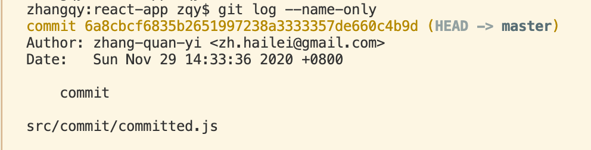
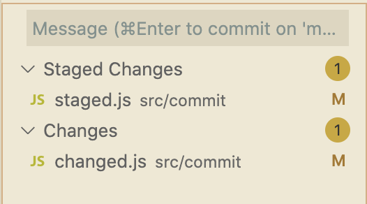
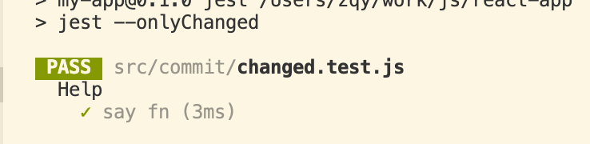
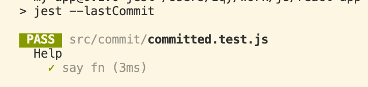
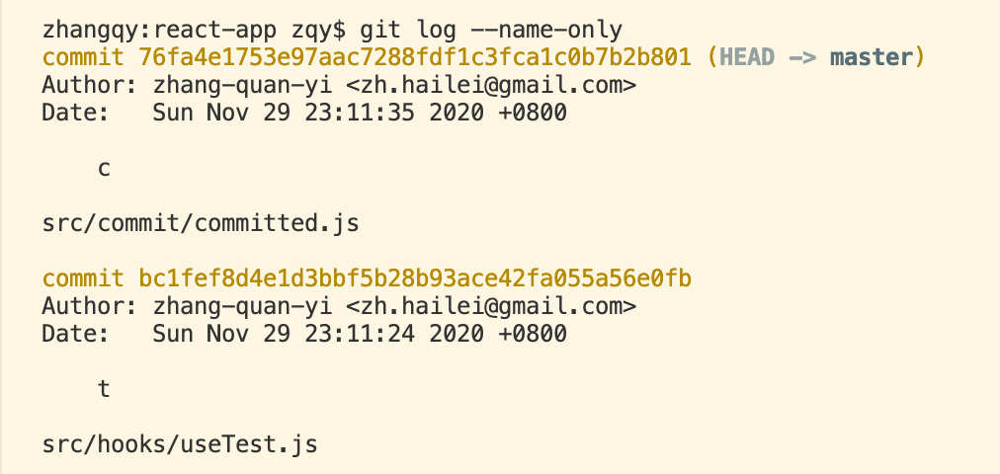
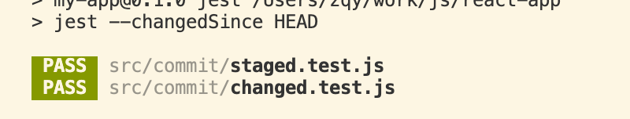
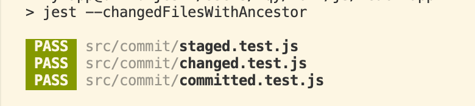

# Jest CLI: 如何执行相关文件的测试用例

> 2020 11 29

在完成了某个功能改动之后，提交代码时，往往需要执行一遍测试用例。如果每次都把整个项目的测试用例跑一遍，实在是费时费力。那么，如何只执行部分相关文件的测试用例呢？

其实 Jest CLI 工具已经为我们提供了一些相关选项，所以我们就来看一看，它们有什么效果与区别：

- `--onlyChanged`
- `--lastCommit`
- `--changedSince`
- `--changedFilesWithAncestor`

## Git 项目初始状态：

我对项目中有三个文件进行了修改：

- committed.js
- staged.js
- changed.js

其中 `committed.js` 文件已经提交（通过 `git commit` 命令）。

`staged.js` 文件已经加入暂存区（通过 `git add` 命令）。
`changed.js` 文件内容做了修改，并没有应用 `git` 命令。

## `--onlyChanged`

该选项会匹配当前项目中已经修改过的文件。
例如执行 `jest --onlyChanged` 命令，会有如下效果：

可以看到，只匹配到了 `changed.js` 文件，加入到暂存区的文件是无法匹配到的。

## --lastCommit

匹配上一次 commit 的文件；
例如执行 `jest --lastCommit` 命令，会有如下效果：

可以看到，匹配到了 `committed.js` 文件。

## --changedSince

该选项需要提供一个提交点作为参考值，该参考点以后的所有改动的文件都会被匹配到。既然需要参考点，那么我们先看下我们目前的提交日志：

例如执行 `jest --changedSince HEAD` 命令，也就是以最新一次提交作为参考点，会有如下效果：

匹配到了 `changed.js` 和 `staged.js` 两个文件，也就是所有未提交的文件。

如果执行 `jest --changedSince HEAD^` 命令，也就是以上一次提交作为参考点（commit bc1f 开头的 hash 值），会有如下效果：

这次同样匹配了 `changed.js` 和 `staged.js` 文件，同时，最近提交的 `committed.js` 文件也匹配到了。

## --changedFilesWithAncestor

其实，该命令与 `jest --changedSince HEAD^` 命令等价，请看执行效果：

## 结论

就一般而言，如果需要在 `pre-commit` hook 执行相关文件的测试用例的话，`jest --changedSince HEAD` 命令是可以满足需求的。但不足的是，仅修改、但不打算提交的文件，也会匹配到，如上文中的 `changed.js` 文件。
