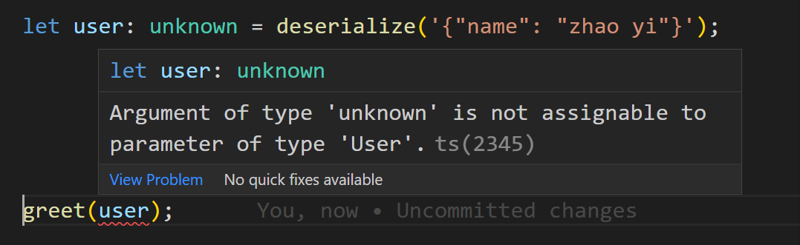
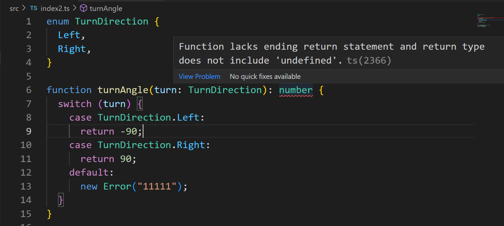

# Typescript unknown 类型介绍

在开发项目时，当我们无法通过 typescript 类型检查时，最终的解决方案往往是使用 `any` 类型。`any` 类型非常强大，可以解决几乎所有的类型校验错误。但 `any` 类型在给我们提供便利的同时，也让我们的类型标注变得脆弱。在有些时候，可以使用 `unknown` 来替代 `any` 类型，使得类型标注更安全。同时这也是 Typescript 的职责，确保在正确的值上调用正确的方法。

`any` 与 `unknown` 的共同点是，都可以将任何其他类型的值复制给 `any` 类型或者 `unknown` 类型。比如：

```typescript
const n = 1;
const r1: any = n;
const r2: unknown = n;
```

这段代码可以通过 Typescript 类型检测的。
那么 `any` 类型和 `unknown` 类型有什么区别呢？变量 `r1` 具有 `any` 类型，它表示 `r1` 可以是任何类型，可以对 `r1` 做任何操作；即使 `r1` 是 `number` 类型，`r1.push` 的调用依然是合法的，这无形中失去了 Typescript 给我们带来的类型安全性。
而 `r2` 具有 `unknown` 类型，它表示 `r2` 可以是任何类型，但是 `r2` 不支持任何操作。
所以在某些场合中，使用 `unknown` 类型，可以限制某些变量的行为，使我们的编码习惯更加谨慎。

在我们详细讨论 `unknown` 之前，先让我们了解下前置知识：子类型的基础知识。

## 子类型基础介绍

如果在期望类型 **Type** 实例的任何地方，都可以安全地使用类型 **SubType** 的实例，那么我们称类型 **SubType** 是类型 **Type** 的子类型。
所以，如果类型 **SubType** 是类型 **Type** 的子类型，那么任何使用类型 **Type** 的地方，都可以类型安全地使用类型 **SubType** 的实例。

### 在 Typescript 中通过继承实现父子类型

在下方实例中，我们首先创建了 `People` 类，然后基于 `People` 创建了 `Staff` 类（继承自 `People` 类）。

```typescript
class People {
  name: string;
  constructor(name: string) {
    this.name = name;
  }
}

class Staff extends People {
  job: string;
  constructor(name: string, job: string) {
    super(name);
    this.job = job;
  }
}

function greet(people: People) {
  console.log(`Hi ${people}`);
}

greet(new People("zhao yi"));
greet(new Staff("qian er", "IT"));
```

可以看到，虽然函数 `greet` 的定义中只接收 `People` 类，但是由于 `Staff` 是 `People` 类的子类型，所以 `greet` 函数可以安全地接收 `Staff` 类型。

如果了解过面向对象的语言，诸如 Java，会对这段代码感到稀松平常。但实质上，在 Typescript 中不使用继承机制，也是可以实现子类型关系的。例如我们有 P1 和 P2 两个类型，那么只要 P1 类型包含 P0 类型的所有成员，那么我们就可以说 P1 是 P0 的子类型。这称之为 **结构子类型**。

## Typescript 中的通过结构子类型实现父子类型。

与上面实例相似，我们还是会创建 `People` 与 `Staff` 类型，但这次我们不使用 `class`，而是使用 `interface` 来实现：

```typescript
interface People {
  name: string;
}

interface Staff {
  name: string;
  job: string;
}

const people: People = {
  name: "zhao yi",
};

const staff: Staff = {
  name: "qian er",
  job: IT,
};

function greet(people: People) {
  console.log(`Hi ${people}`);
}

greet(people);
greet(staff);
```

可以看到，Staff 接口包含了 People 接口的所有成员。函数 greet 期望接收 People 接口（类型）的参数。如果将参数改为 Staff 接口类型，那么同样可以通过 Typescript 的类型检查。

### 顶层类型：子类型的极端情况

了解了子类型是什么以后，我们来看一种极端情况：**顶层类型**。
顶层类型是其他任何类型的父类型。我们可以定义任何类型，但这些类型都将是顶层类型的子类型。如果将之前的 `greet` 函数的接收参数改为顶层类型，那么 `greet` 可以接收任何类型的参数了。因为任何期望父类型的地方，都可以安全使用子类型。
在 **Typescript** 中，`Object` 类型是除了 `null` 和 `undefined` 之外的大部分类型的父类型。所以，我们可以将这三种类型的和类型作为顶层类型： `Object | null | undefined`。实际上，**Typescript** 是有顶层类型的定义的，该类型就是 `unknown`。
（注：在 **Typescript** 中值 `null` 的类型是 `null`，而值 `undefined` 的类型是 `undefined`）

接下来，通过一个具体场景，来看下 `unknown` 使如何使我们的类型定义更加安全的。

```javascript
function deserialize(input) {
  return JSON.parse(input);
}

function greet(user) {
  console.log(`Hi ${user.name}`);
}

const user = deserialize('{"name": "zhao yi"}');
greet(user);
```

这是一段 **Javascript** 代码，那么如何给这段代码添加类型标注呢？
这段代码的特殊点在于 `JSON.parse` 的结果是不固定的，可以是任意结构。所以 `JSON.parse` 的返回值类型是 `any`。
仿照 `JSON.parse` 的定义，我们可以添加如下类型标注：

```typescript
interface User {
  name: string;
}

function deserialize(input: string): any {
  return JSON.parse(input);
}

function greet(user: User) {
  console.log(`Hi ${user.name}`);
}

greet(deserialize('{"name": "zhao yi"}'));
```

这段代码可以顺利通过 **Typescript** 的类型检查，看上去很完美。但当我们遇到这样的代码时 `greet(deserialize('{}'));`，同样可以通过类型检查。这让我们的代码变得不那么安全。
该如何解决呢？一种方式是可以在使用 `deserialize` 的结果之前进行手动校验，以确保值是我们期望的类型：

```typescript
let user: any = deserialize("{}");
if (isUser(user)) {
  greet(user);
}
function isUser(user: any): user is User {
  if (user === null || user === undefined) {
    return false;
  }
  return typeof user.name === "string";
}
```

这样，我们可以保证 greet 函数总是接收到 User 类型的 `deserialize` 返回值。
美中不足的是，这种处理方式无法强制开发者使用 isUser 进行类型检查。开发者很容易忘记调用 `isUser`，从而允许 `deserialize` 得到的任意结果被传入 `greet` 函数。
那么有没有另外一种方式，可以表达 “这个对象可以是任意类型”，但是没有 `any` 类型暗含的 “相信我，我知道我在做什么” 的意义，这不是更好吗？
这就是 `unknown` 类型用武之地了。作为顶层类型，`unknown` 可以接收任何类型的值，但是 `unknown` 类型并不许诺可以对该值做任何处理。实际上，**Typescript** 不允许对 `unknown`

```typescript
function deserialize(input: string): unknown {
  return JSON.parse(input);
}
```

在代码中，我们将 deserialize 函数的返回结果改成了 unknown。因为 unknown 类型是顶层类型，任何使用 unknown 的地方，都可以使用任何其他类型。也就是说，可以将任何类型的值，赋值给 unknown 类型：

```typescript
let user: unknown = deserialize('{"name": "zhao yi"}');
```

只是这次在调用 greet 函数的时候，Typescript 将会阻止我们，并提示类型错误：


这将强制我们对 deserialize 的返回结果进行判断：

```typescript
let user: unknown = deserialize('{"name": "zhao yi"}');

if (isUser(user)) {
  greet(user);
}
```

这样我们就不用担心，忘记检查 deserialize 的返回结果，直接调用 greet 函数了。

## 底层类型

如果一个类型是其他类型的子类型，我们称之为底层类型。要成为其他类型的子类型，它必须具有其他类型的成员。但是我们可以有无限个类型和成员，所以底层类型也必须有无限个成员。这是不可能的，所以底层类型始终是一个虚拟概念，不包含任何值。在 Typescript 中，类型 never 是底层类型，我们可以把它赋值给其他任何类型。

接下来的示例中，我们会实现一个处理向左向右的转向函数：

```typescript
enum TurnDirection {
  Left,
  Right,
}

function turnAngle(turn: TurnDirection): number {
  switch (turn) {
    case TurnDirection.Left:
      return -90;
    case TurnDirection.Right:
      return 90;
    default:
      throw new Error("错误：非法转向！");
  }
}
```

这个代码可以按照预期工作。但是在我们的项目中，在 tsconfig 的配置中开启了 `strict` 配置，那么示例代码将不会通过类型检查：

最后的 default 分支没有 `return` 语句，那么默认返回 `undefined` 值，这与 `turnAngle` 的返回值 `number` 类型冲突了。
