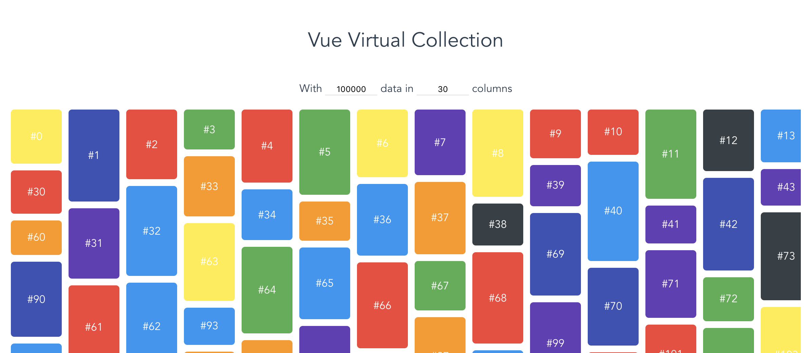

# vue-virtual-collection——滚动加载组件的原理解析
> 2018年05月06日 vue vue组件 瀑布流

## 它是做什么的？
前阵子在网上看到了一个有关滚动加载的 `vue`组件，它的`demo`页是这样的：



看到它的布局，与加载的数据量(100000...)，我一下子感兴趣了。

`vue-virtual-collection` 是一个针对瀑布流的 `vue`滚动组件，由于它不会渲染全部数据，而是把当前 `viewport`中展示的 `Cell`(内容色块)渲染出来，所以性能上比渲染全量数据好很多。

原作者的发布的介绍文章：[使用 vue-virtual-collection 优化滚动性能](https://zhuanlan.zhihu.com/p/34380557)

项目地址： [starkwang/vue-virtual-collection](https://github.com/starkwang/vue-virtual-collection)

如果你不满足上面的介绍，想要了解具体的原理及实现，请继续以下内容：

* `Demo`页是如何布局的?
* 什么是`块渲染`？
* 如何计算将要显示的`块`？；


## Demo页是如何布局的
看一下 `css`样式，可以发现 `Cell`都是绝对定位来布局的。而具体的 `left`，`top`计算，可以在项目的`demo/src/index.vue`中找到：

```javascript
// 页面上有多少列
const columnAmount = 30

// 存储每个列被占用的高度
const columnHeight = new Array(columnAmount).fill(0)

const cells = new Array(100000).fill(1)

cells = cells.map((cell, index) => {
    // 通过 index来确定Cell处于哪个列
    const column = index % columnAmount
    const height = 50 + 100 * Math.random()
    const result = {
        data: {
            text: `#${index}`,
            color: this.randomColor()
        },
        // css布局用到的数据
        height,
        width: 75,
        x: column * 85,
        y: columnHeight[column]
    }
    
    // 保存当前元素的下边界位置
    columnHeight[column] += height + 10
    return result
})

```

如果将上述100000个 `cell`（内容快）一次性渲染到页面上，那么整个页面的宽度大概是2550px（85*30）、高度将超过100000px，远大于浏览器的视图大小。那么，我们如何将如此大的页面分成多个小块，并且只显示出现在浏览器视图的内容呢？

## 什么是块渲染？
以下内容摘自原作者的文章：
<br>


将整个页面划分为多个块，所有与这个块有重叠的 `Cell` 都会在这个块中记录下来。根据上图一，会得到以下map数据：

```javascript
{
  "0.0": [1, 2, 3, 5], // 00块与1,2,3,5号Cell有重叠，下同
  "0.1": [5, 3, 6, 7],
  "0.2": [7, 6, 8, 9],
  "1.0": [2, 3, 4],
  "1.1": [3, 4, 6],
  "1.2": [6, 9]
}

```
如果此时浏览器视图窗口所在的位置如图二所示，那么我们就可以只显示0.0，0.1，1.0，1.1这四个块的内容；根据 `map`表，这四个块包含的 `cell`有:

- [1,2,3,5]
- [5,3,6,7]
- [2,3,4]
- [3,4,6]

去除重复的 `cell`，我们只需要显示 `cell`为

- 1,2,3,4,5,6,7

而其余的 `cell`并不需要显示；

## 如何计算将要显示的块？

#### 注意三个步骤：

1. 初始化数据列表；
2. 通过计算，将每个 `cell`划分给特定的`section`（块）
3. 计算浏览器视图窗口内所需显示的cell

#### 所用到的类：
`src/SectionManager.js`

```javascript
class SectionManager{
	constructor(){
		// 存储所有的section
		this._sections = {}
	}
	
	// 将cell存入相重叠的section中
	registerCell({cell,index})
	
	//计算与当前的cell（内容块）所重叠的section，返回所有的与当前cell重叠的section
	getSections(cell)
}
```

`src/section.js`

```javascript
class Section{
	constructor(){
		// 该section所有的cell的下标；
		this._indics = []
	}
	
	// 保存cell的下标
	addCellIndex({index})
	
	// 返回该section所保存的cell的全部下标
	getCellIndices()
}

```

#### 1. 初始化数据列表 

`demo/src/index.vue`：

```javascript
// 页面上有多少列
const columnAmount = 30

// 存储每个列被占用的高度
const columnHeight = new Array(columnAmount).fill(0)

// cells是数据列表，可以是从后台获取的数据； 
const cells = new Array(100000).fill(1)

// 初始化列表数据，包括宽度、高度、x坐标、y坐标；
cells = cells.map((cell, index) => {
    // 通过 index来确定Cell处于哪个列
    const column = index % columnAmount
    const height = 50 + 100 * Math.random()
    const result = {
        data: {
            text: `#${index}`,
            color: this.randomColor()
        },
        // css布局用到的数据
        height,
        width: 75,
        x: column * 85,
        y: columnHeight[column]
    }
    
    // 保存当前元素的下边界位置
    columnHeight[column] += height + 10
    return result
})
```

#### 2. 通过计算，将每个 `cell`划分给特定的`section`（块）：

`src/VirtualCollection.vue`

```javascript
created() {
    this.init()
}
...

init() {
	this.registerCellsToSectionManager()
}

registerCellsToSectionManager() {
	if (!this._sectionManager) {
		this._sectionManager = new SectionManager(this.sectionSize)
	}
	
	...
	
	// this.collection 就是初始化时的cells数据列表；
	this.collection.forEach((item, index) => {
		
		// cellMetadatum = {x,y,width,height}
		const cellMetadatum = this.cellSizeAndPositionGetter(item, index)
		
		// 将单个cell的下标存到所属的section（块）中
		this._sectionManager.registerCell({
			index,
			cellMetadatum
		})

		...
	})
}
```

`src/SectionManager.js`

```javascript
registerCell({ cellMetadatum, index }) {
	this._cellMetadata[index] = cellMetadatum

	this.getSections(cellMetadatum).forEach((section) => {
		// 将cell的下标存入section中；
		section.addCellIndex({ index })
	})
}

// 计算与当前的cell（内容块）所重叠的section，返回所有的与当前cell重叠的section；
getSections({ height, width, x, y }) {

  	// 根据cell的坐标、大小，计算出cell所处的secion块的范围；
  	// 如上图，cell #3所占据的section为：x：0-1；y：0-1
	const sectionXStart = Math.floor(x / this._sectionSize)
	const sectionXStop = Math.floor((x + width - 1) / this._sectionSize)
	const sectionYStart = Math.floor(y / this._sectionSize)
	const sectionYStop = Math.floor((y + height - 1) / this._sectionSize)

	// 用于保存所有符合的secion；
	const sections = []
	
	for (let sectionX = sectionXStart; sectionX <= sectionXStop; sectionX++) {
		for (let sectionY = sectionYStart; sectionY <= sectionYStop; sectionY++) {
			const key = `${sectionX}.${sectionY}`
	
			if (!this._sections[key]) {
				this._sections[key] = new Section({
					height: this._sectionSize,
					width: this._sectionSize,
					x: sectionX * this._sectionSize,
					y: sectionY * this._sectionSize
				})
			}
	
			sections.push(this._sections[key])
		}
	}

	// 返回所查找的section
	return sections
}

```

`src/section.js`:

```javascript
export default class Section {
	constructor({ height, width, x, y }) {
		...
		
		this._indexMap = {}
		this._indices = []
	}
	
	addCellIndex({ index }) {
		// 保证每个index只保存一次，防止同一个index多次保存
		if (!this._indexMap[index]) {
			this._indexMap[index] = true
		
			// 将cell对应的下标存入section中； 
			this._indices.push(index)
		}
	}
}
```

#### 3. 计算浏览器视图窗口内所需显示的cell
`src/VirtualCollection.vue`

```javascript
init(){
	...
	this.registerCellsToSectionManager()
	
	// 显示浏览器视图窗口内的cell 
	this.flushDisplayItems()
}

flushDisplayItems() {
	let scrollTop = 0
	let scrollLeft = 0
	if (this.$refs.outer) {
		scrollTop = this.$refs.outer.scrollTop
		scrollLeft = this.$refs.outer.scrollLeft
	}
	
	// 所需显示的cell的下标；
	var indices = this._sectionManager.getCellIndices({
		// 浏览器视图窗口的坐标和大小；
		height: this.height,
		width: this.width,
		x: scrollLeft,
		y: scrollTop
	})
	...
}
```

`src/SectionManager.js`

```javascript
getCellIndices({ height, width, x, y }) {
	const indices = {}

	// 此时把浏览器的视图窗口看作是一个cell，获取与该cell重叠的section；
	this.getSections({ height, width, x, y }).forEach(section =>{
		section.getCellIndices().forEach(index => {
			indices[index] = index
		})
	})

	// Object keys are strings; this function returns numbers
	return Object.keys(indices).map(index => indices[index])
}
```

## 总结
示例的特点：

1. 从初始化列表数据时可以发现，页面布局依赖于绝对定位，并且将页面元素都定位到一个虚拟坐标系中。
2. section的坐标的条目数是多少呢？

因为通过计算后，我们会得到类似下面的map表：

```javascript
{
  "0.0": [1, 2, 3, 5],
  "0.1": [5, 3, 6, 7],
  "0.2": [7, 6, 8, 9],
  "1.0": [2, 3, 4],
  "1.1": [3, 4, 6],
  "1.2": [6, 9]
}
```
那么map表中有多少条目呢？
这里我们粗略地计算一下。

```javascript
假设有n条数据，每条数据的宽度高度都是80px，如果每行显示m条数据，那么:
页面总宽度：m*80px;
页面总高度：(n/m)*80px；

这时，如果section是边长为sd的正方形，那么section的坐标范围将会是：
x坐标：0-(页面总宽度/sd)
y坐标：0-(页面总高度/sd)

也就是
x坐标：0-(m*80/sd);
y坐标：0-((n/m)*80/sd);

总的坐标组合数x*y：
(m*80/sd) * ((n/m)*80/sd) = 6400*n/(sd^2)

```

